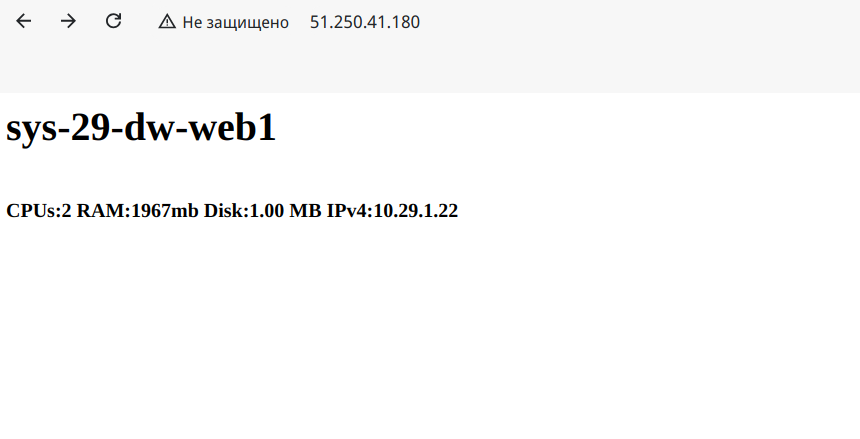
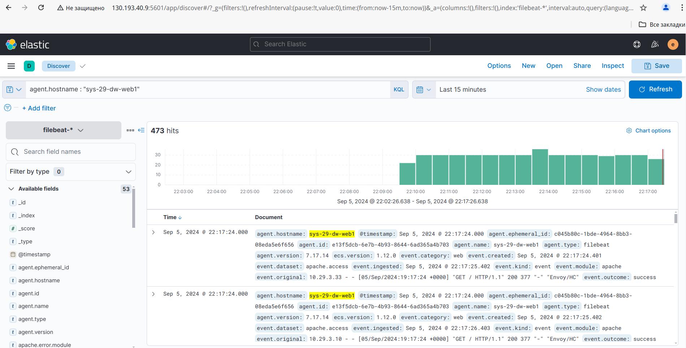
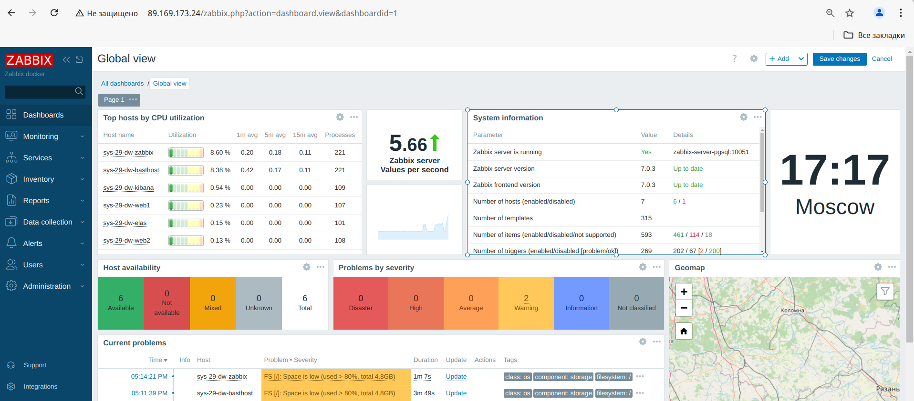
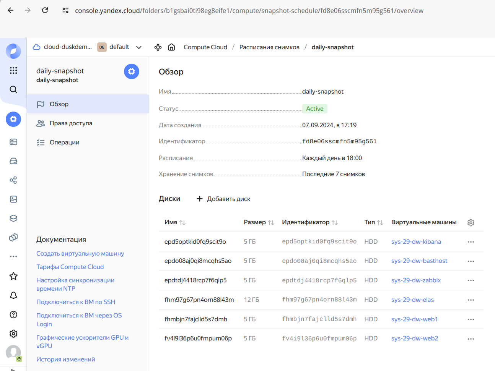

# Домашнее задание к занятию "`Дипломная работа профессии Системный администратор`" - `Дунаев Дмитрий`

### Сделано:

1. Terraform

resources.tf - разворачиваем хосты:

    sys-29-dw-basthost (через cloud-init ставим ansible)
    sys-29-dw-kibana
    sys-29-dw-zabbix
    sys-29-dw-elas
    sys-29-dw-web1
    sys-29-dw-web2

ip-адреса хостов:

Балансировщик (доступ к сайту)
51.250.36.229

Заббикс sys-29-dw-zabbix
89.169.173.24

Кибана sys-29-dw-kibana
89.169.174.150

2. Скриптом записываем в файл их внешние и внутренние адреса для дальнейшей с ними работы. 
 _Это не годится, используем для этого имена хостов, поправил файлы ТФ._

3. Подготовка Ansible плейбука для раскатки apache на веб-серверах.
Пробный запуск Ансибл. Плейбук в процессе. Нет выхода в инет с внутренних хостов, нужно настраивать.
 _Поправил настройку сети в конфиге network.tf, выход через nat есть._

4. Подготовка плейбука на локальном хосте для проброса файлов для Ansible на basthost.

5. Подготовка Ansible плейбука для установки elastic.

6. Создание и настройка балансировщика для веб-хостов.

7. Подготовка Ansible плейбука для kibana, настройка связи с elastic.

8. Подготовка Ansible плейбука для раскатки Zabbix на сервере.

9. Подготовка Ansible плейбука для раскатки Zabbix agent 2 на хостах.

10. Настройка мониторинга хостов на сервере Zabbix через веб-интерфейс.

11. Настройка бэкапов дисков ВМ (snapshot) в консоли Яндекс Облака.

### Список файлов

/img

скриншоты в формате png.

scheme01.png - схема проекта

/templates

index.html.j2 - шаблон файла index.html для веб-серверов

/elk_conf

elas_config.yml - конфиг elasticsearch

filebeat.yml - конфиг filebeat

kiba_config.yml - конфиг kibana

ansible.cfg - конфиг Ансибл

inventory* - файлы инвентори для Ансибл

playbook* - файлы плейбуков для Ансибл

*.tf - файлы конфига терраформ

network.tf - конфигурация сетей и подсетей

main.tf - конфигурация ВМ

resources.tf - конфигурация целевых групп, групп бэкэндов, роутера, вхостов и балансировщика

### Порядок развертывания

1. Запуск скрипта init.sh для получения свежего токена yandex cloud

2. Запуск терраформа:

```
terraform plan --out=current
terraform apply current
```

Получаем ip-адрес балансировщика:

```
yc alb load-balancer show sys-29-dw-alb | grep address
```

3. Запуск ансибл плейбука для передачи конфигов на бастион-хост (basthost):

скорректировать ip-адрес basthost согласно output терраформа в inventory_bh.ini
```
ansible-playbook -i inventory_bh.ini playbook-bh.yml --vault-id @prompt
```

4. Подключаемся на basthost и запускаем плейбуки для раскатки docker, elastic, kibana, web, filebeat, zabbix.

```
ssh -i ~/.ssh/dw dusk@89.169.172.115
cd ansible
ansible-playbook -i inventory.ini playbook-dock.yml playbook-elas.yml playbook-kb.yml playbook-web.yml playbook-fb.yml playbook-za2.yml
```

5. Проверяем работу сайта. Обращаемся в браузере по адресу, который получил балансировщик (см. п. 2), и проверяем, что он корректно отдает страницы наших веб-серверов, нажав несколько раз F5. Должны отображаться разные имена хостов поочередно:



6. Проверяем интерфейс кибаны, логинимся через браузер по внешнему адресу (смотрим terraform output) и порту 5601, вводим логин и пароль. Проверяем, что в интерфейсе кибаны появились логи с обоих хостов веб-кластера, открыв через меню discover и полистав события из лога веб-сервера apache, которые должны отображаться от обоих agent.hostname:



7. Подключаемся к веб-интерфейсу zabbix, добавляем на мониторинг созданные хосты через "New host" по dns именам. Проверяем, что информация от агента поступает, и метрики хостов отображаются на dashboard:



8. Настраиваем в консоли яндекс Облака создание ежедневных snapshots для всех дисков ВМ, составляющих нашу инфраструктуру:

